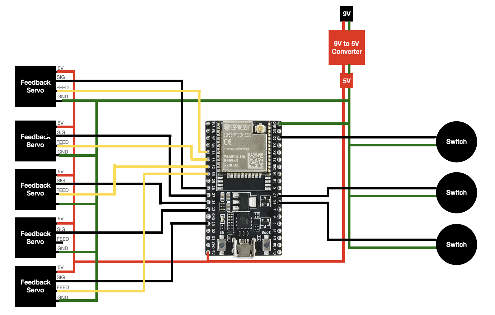

# Amp Bot

Control amp knobs with a footswitch

## Getting Started

Update `settings.py` with the pins you are using.

> In this example, you can see the pins in the [Diagram](#diagram) map to tuples as such:
> ```python
> # set switch pins in ascending order (switch pin, led pin)
> SWITCH_PINS = [
>    (16, 19,),
>    (17, 18,),
>    (22, 5,)
> ]
>
> # set servo pins in ascending order (signal pin, feedback pin)
> SERVO_PINS = [
>    (26, 34,),
>    (27, 35,),
>    (14, 32,),
>    (12, 33,),
>    (13, 25,),
> ]
> 
> ```

## Hardware

### Diagram



### Parts List