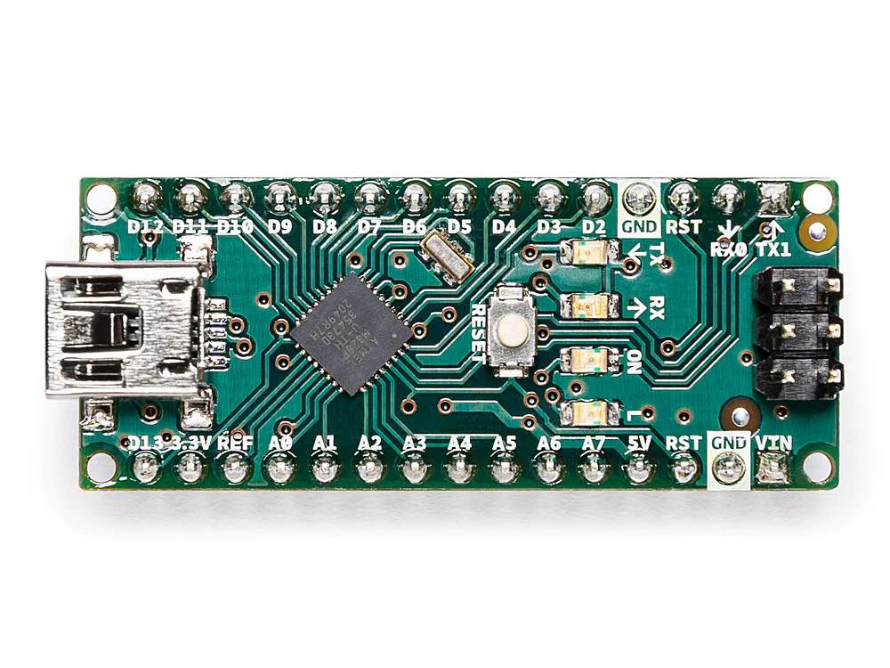

# Amp Bot

Control amp knobs with a footswitch

## Setup

Connect switches, leds, and servos to the pins you want. Then update `amp_bot.h` with your pinout.

> Suggested:
>
>   TBD
> 
> See [Wiring](#wiring)

## Wiring

TBD

